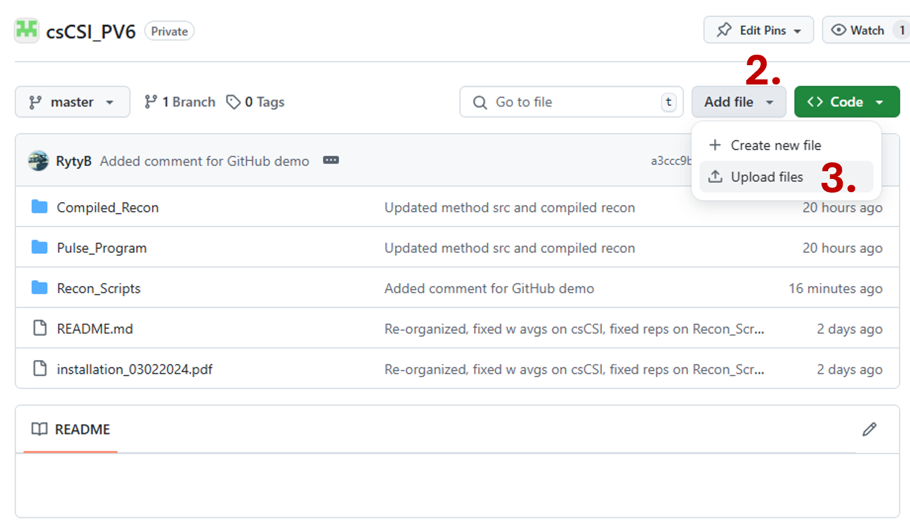

<h1> HDO Imaging is a Quantitative Marker of Cerebral Glucose Oxidation </h1>

Funding Project Number: 5R01EB032376-03

Principle Investigators: Matthew Merritt, James Bankson, Vikram Kodibagkar

<h2> Workflow with the online GitHub GUI </h2>
<h3><b>How can I download code?</b></h3>

1. Navigate to the repository that you want to download. 
    
2. Click "Code" on the top right.
3. Click download ZIP

Individual files can also be downloaded by navigating to the file within the repository and clicking
on the download icon shown above. 

<h3><b>How can I make small edits to existing code?</b></h3>

1. Navigate to the file you want to edit.
    
2. Click the dropdown by the edit icon.
3. Click edit in place to use the GitHub online text editor.

    
4. Make the edits you want to make.
5. Click commit changes to save your work. Changes are not saved until you commit. 

    
6. Make a descriptive comment so that future editors understand what you changed.
7. For small, safe edits, it is usually okay to commit directly to the master branch. For more invasive
edits to a repository that someone else is primarily maintaining, it may be a good idea to branch and 
submit a pull request. See the section in Advanced Git Workflow if you would like to submit a pull 
request and ensure compatibility of your edits.  

<h3><b>How can I upload new files to a repository?</b></h3>

1. Navigate to the repository that you'd like to add to.
    
2. Click the drop down menu for add file. 
3. Click upload file. 
    
4. Drag and drop the file or files from your computer to the repository.
5. Click commit changes. Again, if your additions to the code base are safe, it
should be fine to commit directly to the master branch. If you are uploading something weird,
or are unsure, then it may be a good idea to create a new branch and submit a pull request. 

<h3><b>Where can I view previous versions of code?</b></h3>

1. Navigate to the repository that you'd like to see.
    
2. Click the icon which diplays the number of past commits.
    
3. Click the pair of braces on the side of the commit that you would like to view. 

<h3><b>How can I complain that someone's code is not working the way it should?</b></h3>

1. Navigate to the broken repository. 
    
2. Click the issues tab in the ribbon at the top of the page. 
3. Click New Issue. 
4. Fill out the pop up that comes up. 

<h2>  Advanced Git workflow </h2>
<h3><b>If you are the sole maintainer of a repository...</b></h3>
For everyday workflow (for our purposes) when you are the only one working on a codebase at a time,
it should be okay to not worry about branching or pull requests and edit the master branch directly.
The advantage of this approach is its simplicity. To make major edits, you can use the workflow outlined
above if you're okay with using the GitHub text editor. If you want to use your own tools, then the
work flow is as follows. 

1. <b>Clone</b> repository and make sure that it is up to date using git pull or similar. All the code and 
the version log are now local on your machine.  
2. <b>Edit</b> the code base in the way that you want to. 
3. <b>Stage</b> your changes. 
4. <b>Commit</b> your staged changes.
5. <b>Push</b> your changes to GitHub.com. The code that you edited can now be viewed by people with the right
permissions on other machines. 

The process may look a little different depending on what software you're using to run git (i.e. MATLAB, command line, 
GitHub desktop, or GitHub online), but the workflow is the same as all of these UI are relying on the same dependency software (git). 

<h3><b>If you are not the primary maintainer of a repository or are working collaboratively...</b></h3>
For closer collaboration it becomes necessary to use branching to make sure that your changes
are compatible with the changes of your collaborators. In this case, branching is the preferred method.
A branch is like a parallel version of the codebase that can be edited while the master branch remains 
intact. This is one of the safest ways to edit code, but it is a little more complicated than just editing
the master branch directly.

1. <b>Clone</b> repository and make sure that the it is up to date using git pull or similar. 
2. Create a new <b>Branch</b> to house your edits. 
3. <b>Edit</b> the codebase in the new branch.
4. <b>Stage</b> your changes.
5. <b>Commit</b> your changes to the new branch.
6. Create a pull request to <b>Merge</b> your modified branch with the master branch. This will
create a notification on GitHub and the primary maintainer of the code can accept if it is safe.
Alternatively, you can merge the branches yourself if you are the primary maintainer. 
